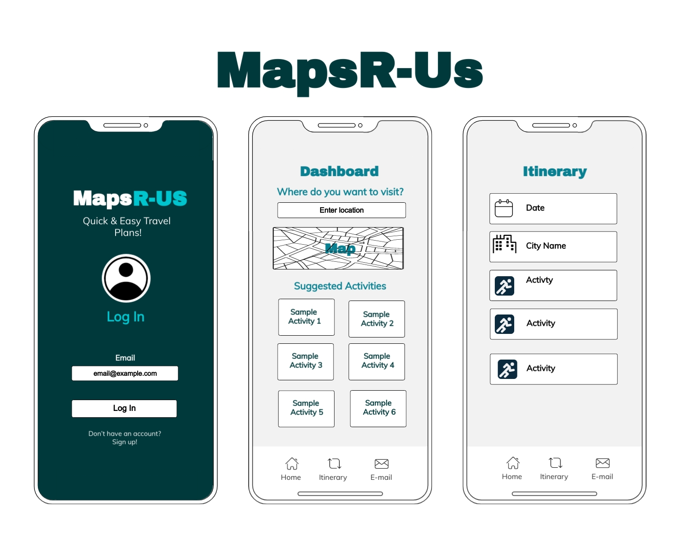

# MapsR-US - A Travel Guide and Journal App

## Collaborators
- [Erin Sawyer](https://github.com/erinsawyer504)
- [Tyler Cash](https://github.com/tmcash)
- [Kevin Lozano](https://github.com/klozano17)
- [Alexis Joyner](https://github.com/lexcodes26)
- [Elisha Ballard](https://github.com/ldom3976)
- [Lorena Huff](https://github.com/hufflk96)

## Description

An app that allows a user to enter in a city that they want to visit. The user will be able to select which activities interest them and then it is stored in a database that can be recalled again later when they want to look at the different itineraries that they have selected.  

## User Story
```
GIVEN a user wants to go on a trip
GIVEN a user wants to find a activites/places to go in a selected city
WHEN a search for a city is executed on our site
THEN they are presented with different activities/places of interest in that area
THEN they are able to click on which activities interest them and be stored in an intinerary
THEN they are able to choose itineraries that were previously saved to view the information  
```

## Technologies Used

- HTML/CSS
- JavaScript
- Express
- HERE Maps API
- MySql - Sequelize
- Handlebars

## WireFrame
   

## Visual Representation


## Links

- [Repo](https://github.com/tmcash/maps-r-us)